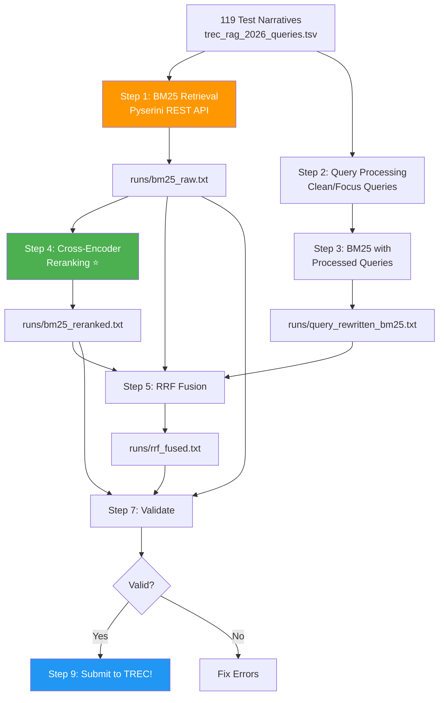

# TREC RAG 2026 Retrieval — Complete Walkthrough

## 🎯 What Was Built

A complete **end-to-end retrieval pipeline** for the TREC RAG 2026 Retrieval (R) task. Everything you need to go from zero to a submitted TREC run.

> [!IMPORTANT]
> **Deadline: August 8, 2026** — You have ~8 days. Follow this walkthrough in order.

## 📁 Project Location

All code has been written to:
```
C:\Users\kash\.gemini\antigravity\scratch\trec-rag-2026-retrieval\
```

> [!TIP]
> Set this as your active workspace in Antigravity for easier navigation.

## Files Created

| File | Purpose | Size |
|------|---------|------|
| [config.py](file:///C:/Users/kash/.gemini/antigravity/scratch/trec-rag-2026-retrieval/config.py) | All configuration constants (API URL, model, run ID) | 2.7 KB |
| [01_bm25_retrieve.py](file:///C:/Users/kash/.gemini/antigravity/scratch/trec-rag-2026-retrieval/01_bm25_retrieve.py) | BM25 retrieval via Pyserini REST API | 8.9 KB |
| [02_query_processing.py](file:///C:/Users/kash/.gemini/antigravity/scratch/trec-rag-2026-retrieval/02_query_processing.py) | Clean/focus narrative queries | 7.5 KB |
| [03_bm25_retrieve_processed.py](file:///C:/Users/kash/.gemini/antigravity/scratch/trec-rag-2026-retrieval/03_bm25_retrieve_processed.py) | BM25 with cleaned queries | 3.4 KB |
| [04_rerank.py](file:///C:/Users/kash/.gemini/antigravity/scratch/trec-rag-2026-retrieval/04_rerank.py) | Neural cross-encoder reranking | 9.6 KB |
| [05_rrf_fusion.py](file:///C:/Users/kash/.gemini/antigravity/scratch/trec-rag-2026-retrieval/05_rrf_fusion.py) | Reciprocal Rank Fusion of multiple runs | 4.4 KB |
| [06_spot_check.py](file:///C:/Users/kash/.gemini/antigravity/scratch/trec-rag-2026-retrieval/06_spot_check.py) | Manual quality inspection | 4.0 KB |
| [07_validate_run.py](file:///C:/Users/kash/.gemini/antigravity/scratch/trec-rag-2026-retrieval/07_validate_run.py) | Validate run file before submission | 7.1 KB |
| [run_pipeline.py](file:///C:/Users/kash/.gemini/antigravity/scratch/trec-rag-2026-retrieval/run_pipeline.py) | Run all steps with one command | 3.6 KB |
| [requirements.txt](file:///C:/Users/kash/.gemini/antigravity/scratch/trec-rag-2026-retrieval/requirements.txt) | Python dependencies | 385 B |
| [README.md](file:///C:/Users/kash/.gemini/antigravity/scratch/trec-rag-2026-retrieval/README.md) | Full documentation | 7.1 KB |
| [.gitignore](file:///C:/Users/kash/.gemini/antigravity/scratch/trec-rag-2026-retrieval/.gitignore) | Git ignore rules | 214 B |

---

## ⚡ Step-by-Step Execution Guide

### 🔴 Step 0: URGENT — Do These NOW (while waiting for API token)

These take time and are **blockers**:

#### A. Register for TREC
1. Go to https://trec.nist.gov/cfp.html
2. Register your organization
3. Note your credentials for submitting runs later

#### B. Request Pyserini API Token
1. **Email `get-pyserini@googlegroups.com`** right now
2. Subject: "Pyserini API token request for TREC RAG 2026"
3. Body: Briefly mention you're participating in TREC RAG 2026
4. This can take 1-2 days — do it NOW

#### C. Join the Mailing List
1. Go to https://groups.google.com/g/trec-rag-2026-participants
2. Request to join, mentioning TREC RAG

---

### 🔴 Step 1: Install Python

Since Python isn't installed on your machine:

1. Go to https://www.python.org/downloads/
2. Download Python 3.12 (or 3.10+)
3. **IMPORTANT**: During installation, check ✅ **"Add Python to PATH"**
4. Verify: Open a new terminal and run `python --version`

---

### 🔴 Step 2: Set Up the Project

```powershell
# Navigate to the project
cd C:\Users\kash\.gemini\antigravity\scratch\trec-rag-2026-retrieval

# Create virtual environment
python -m venv venv

# Activate it (Windows PowerShell)
.\venv\Scripts\Activate.ps1

# If you get an execution policy error, run this first:
# Set-ExecutionPolicy -ExecutionPolicy RemoteSigned -Scope CurrentUser

# Install core dependencies
pip install requests python-dotenv tqdm
```

---

### 🔴 Step 3: Get the Test Data

```powershell
cd C:\Users\kash\.gemini\antigravity\scratch\trec-rag-2026-retrieval

# Clone the official data repository
git clone https://github.com/TREC-RAG/trec-rag-data.git
```

This gives you the 119 test narratives at:
`trec-rag-data\trec-rag-2026\test-data\trec_rag_2026_queries.tsv`

---

### 🔴 Step 4: Configure Your API Token

Once you receive your Pyserini API token by email:

```powershell
cd C:\Users\kash\.gemini\antigravity\scratch\trec-rag-2026-retrieval

# Create the .env.local file with your token
echo PYSERINI_API_TOKEN=paste_your_actual_token_here > .env.local
```

Also edit [config.py](file:///C:/Users/kash/.gemini/antigravity/scratch/trec-rag-2026-retrieval/config.py) and change `RUN_ID`:
```python
RUN_ID = "yourteam_bm25"  # Change to your team/group name
```

---

### 🟡 Step 5: Run BM25 Retrieval (Your First Run!)

```powershell
cd C:\Users\kash\.gemini\antigravity\scratch\trec-rag-2026-retrieval
.\venv\Scripts\Activate.ps1

python 01_bm25_retrieve.py
```

**What happens:**
- Reads all 119 narratives from the TSV file
- Sends each as a BM25 search query to `http://api.castorini.uwaterloo.ca`
- Retrieves top 100 documents per query
- Writes `runs/bm25_raw.txt` in TREC run file format
- Caches raw results (with document text) to `tmp/bm25_results.json` for reranking

**Expected time:** ~5 minutes (with 1-second delay between queries)

**Expected output:** A file `runs/bm25_raw.txt` with ~11,900 lines

> [!NOTE]
> This alone is a valid submission! If time is tight, you can skip straight to Step 8 (validate) and submit this.

---

### 🟡 Step 6: Add Reranking (Biggest Quality Boost!)

Install reranking dependencies:
```powershell
# Option A: FlashRank — CPU-friendly, very fast
pip install flashrank

# Option B: Cross-encoder — better quality, needs GPU
pip install sentence-transformers torch
```

Run reranking:
```powershell
# With FlashRank (CPU, fast):
python 04_rerank.py --flashrank

# With cross-encoder + GPU:
python 04_rerank.py --gpu

# With cross-encoder on CPU (slower but works):
python 04_rerank.py
```

**Output:** `runs/bm25_reranked.txt`

> [!TIP]
> Cross-encoder reranking typically improves nDCG@10 by **20-40%** over BM25 alone. This is the single most impactful step.

---

### 🟢 Step 7 (Optional): Query Processing + Fusion

For even better results:
```powershell
# Process queries
python 02_query_processing.py

# Retrieve with processed queries
python 03_bm25_retrieve_processed.py

# Fuse all runs together
python 05_rrf_fusion.py
```

---

### 🔴 Step 8: Validate Your Run File

```powershell
# Validate your best run file
python 07_validate_run.py runs/bm25_reranked.txt

# Or validate the BM25 baseline
python 07_validate_run.py runs/bm25_raw.txt
```

**Must see:** `✅ VALID — Run file is ready for submission!`

---

### 🔴 Step 9: Submit!

1. Go to **https://ir.nist.gov/evalbase**
2. Log in with TREC credentials
3. Find **TREC RAG 2026** track
4. Upload your run file (best one from `runs/` directory)
5. Mark task: **Retrieval (R)**
6. Name it to match your `RUN_ID`

> [!TIP]
> Submit multiple runs if you have them! You can submit up to 5 runs — submit both BM25 and reranked versions.

---

## Pipeline Architecture



---

## Run File Format Reference

Your submission file looks like this:
```
rag2026-0 Q0 shard_00459_61697 1 12.483799 myteam_bm25
rag2026-0 Q0 shard_00123_45678 2 11.234567 myteam_bm25
rag2026-0 Q0 shard_00789_12345 3 10.987654 myteam_bm25
...
rag2026-118 Q0 shard_00999_00001 100 0.012345 myteam_bm25
```

| Column | Value | Description |
|--------|-------|-------------|
| 1 | `rag2026-0` | Topic/narrative ID |
| 2 | `Q0` | Constant (always "Q0") |
| 3 | `shard_00459_61697` | ClimbMix document ID |
| 4 | `1` | Rank (1 = best) |
| 5 | `12.483799` | Relevance score (higher = better) |
| 6 | `myteam_bm25` | Your run ID |

---

## What Was Tested

- ✅ All 12 Python files created successfully
- ✅ File structure verified
- ⚠️ Python not yet installed on this machine — syntax check pending
- ⚠️ API token needed before retrieval can run

## Next Steps for You

1. **Right now:** Email `get-pyserini@googlegroups.com` for API token
2. **Right now:** Register at https://trec.nist.gov/cfp.html
3. **Today:** Install Python 3.12
4. **Today:** Set up the project (Steps 2-4 above)
5. **When token arrives:** Run the pipeline (Steps 5-9)
